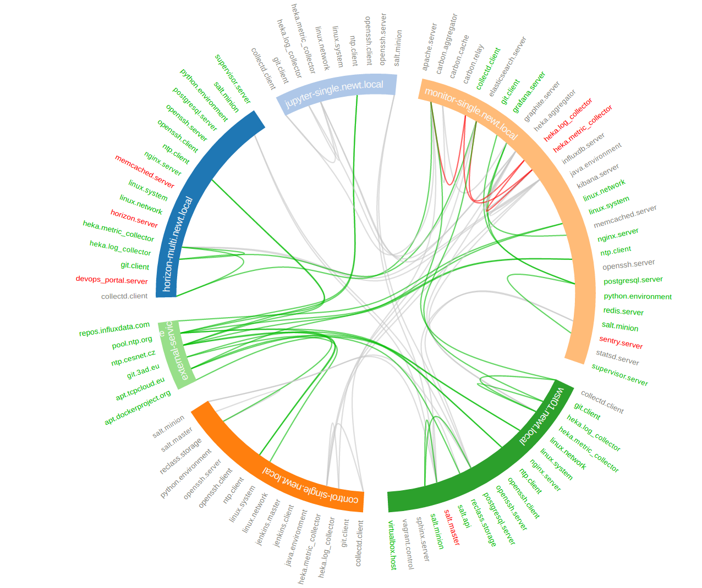

==============================
Infrastucture Metadata Scraper
==============================

Get your live infrastructure topology data from your favorite resource
providers for further processing, visualialitions, etc. Currently supported
providers are:

* Kubernetes cluster
* OpenStack cloud
* Amazon web services
* SaltStack infrastructures
* Terraform templates

Installation
============

Release version of infra-scraper is currently available on `Pypi
<https://pypi.org/project/infra-scraper/>`_, to install it, simply execute:

.. code-block:: bash

    pip install infra-scraper

To bootstrap latest development version into virtualenv, run following
commands:

.. code-block:: bash

    git clone git@github.com:cznewt/infra-scraper.git
    cd infra-scraper
    virtualenv venv
    source venv/bin/activate
    python setup.py install

Configuration
=============

You provide one configuration file for all providers. The default location is
``/etc/infra-scraper/config.yaml`` but it can be overriden by
``INFRA_SCRAPER_CONFIG_PATH`` environmental variable, for example:

.. code-block:: bash

    export INFRA_SCRAPER_CONFIG_PATH=~/scraper.yml

ETCD hosted configuration
-------------------------

You can use ETCD as a storage backend for the configuration and scrape results. Following environmental parameters need to be set:

.. code-block:: bash

    export INFRA_SCRAPER_CONFIG_BACKEND=etcd
    export INFRA_SCRAPER_CONFIG_PATH=/service/scraper/config

Storage configuration
---------------------

You can set you local filesystem path where scraped data will be saved.

.. code-block:: yaml

    storage:
      backend: localfs
      path: /tmp/scraper
    endpoints: {}

You can also set the scraping storage backend to use the ETCD service instead
of a local filesystem backend.

.. code-block:: yaml

    storage:
      backend: etcd
      path: /scraper
    endpoints: {}

Endpoints configuration
-----------------------

Each endpoint kind expects a little different set of configuration. Following
samples show the required parameters to setup individual endpoints.

Amazon Web Services
~~~~~~~~~~~~~~~~~~~

AWS scraping uses ``boto3`` high level AWS python SDK for accessing and
manipulating AWS resources.

.. code-block:: yaml

    endpoints:
      aws-admin:
        kind: aws
        config:
          region: us-west-2
          aws_access_key_id: <access_key_id>
          aws_secret_access_key: <secret_access_key>

Kubernetes
~~~~~~~~~~

Kubernetes requires some information from kubeconfig file. You provide the
parameters of the cluster and the user to the scraper. These can be found
under corresponding keys.

.. code-block:: yaml

    endpoints:
      k8s-admin:
        kind: kubernetes
        layouts:
        - force
        - hive
        config:
          cluster:
            server: https://kubernetes-api:443
            certificate-authority-data: |
              <ca-for-server-and-clients>
          user:
            client-certificate-data: |
              <client-cert-public>
            client-key-data: |
              <client-cert-private>

.. note::

    ``config.cluster`` and ``config.user`` can be found in your ``kubeconfig``
    file. Just copy the config fragment with cluster parameters and fragment
    with user parameter.

OpenStack
~~~~~~~~~

Configurations for keystone v2 and keystone v3 clouds. Config for single
tenant scraping.

.. code-block:: yaml

    endpoints:
      os-v2-tenant:
        kind: openstack
        description: OpenStack (keystone v2) tenant
        scope: local
        layouts:
        - arc
        - force
        - hive
        - matrix
        config:
          region_name: RegionOne
          compute_api_version: '2.1'
          auth:
            username: user
            password: password
            project_name: project-name
            domain_name: 'default'
            auth_url: 'https://keystone-api:5000/v3'

Config for scraping resources from entire cloud.

.. code-block:: yaml

    endpoints:
      os-v2-admin:
        kind: openstack
        description: OpenStack (keystone v2) cloud
        scope: global
        layouts:
        - force
        - hive
        config:
          region_name: RegionOne
          auth:
            username: admin
            password: password
            project_name: admin
            auth_url:  https://keystone-api:5000/v2.0

SaltStack
~~~~~~~~~

Configuration for connecting to Salt API.

.. code-block:: yaml

    endpoints:
      salt-global:
        kind: salt
        layouts:
        - force
        - hive
        config:
          auth_url: 'http://127.0.0.1:8000'
          username: salt-user
          password: password

Terraform
~~~~~~~~~

Configuration for parsing terraform templates.

.. code-block:: yaml

    endpoints:
      tf-aws-app:
        kind: terraform
        layouts:
        - hive
        config:
          dir: ~/terraform/two-tier-aws

Supported Visualization Layouts
===============================

Presented data requires different layouts. Every time you need to emphasise
different qualities of displayed resources. You can choose from several
different layouts to display collected data.

Force-Directed Graph
--------------------

`Force-directed graph` drawing algorithms are used for drawing graphs in an
aesthetically pleasing way. Their purpose is to position the nodes of a graph
in two-dimensional or three-dimensional space so that all the edges are of
more or less equal length and there are as few crossing edges as possible, by
assigning forces among the set of edges and the set of nodes, based on their
relative positions, and then using these forces either to simulate the motion
of the edges and nodes or to minimize their energy.

    Force-directed plot of all OpenStack resources (cca 3000 resources)

Hive Plot
---------

The `hive plot` is a visualization method for drawing networks. Nodes
are mapped to and positioned on radially distributed linear axes — this
mapping is based on network structural properties. Edges are drawn as curved
links. Simple and interpretable.

    Hive plot of all OpenStack resources (cca 3000 resources)

Arc Diagram
-----------

An `arc diagram` is a style of graph drawing, in which the vertices of a graph
are placed along a line in the Euclidean plane, with edges being drawn as
semicircles in one of the two halfplanes bounded by the line, or as smooth
curves formed by sequences of semicircles. In some cases, line segments of the
line itself are also allowed as edges, as long as they connect only vertices
that are consecutive along the line.

    Arc diagram of OpenStack project's resources (cca 100 resources)

Adjacency Matrix
----------------

An adjacency matrix is a square matrix used to represent a finite graph. The
elements of the matrix indicate whether pairs of vertices are adjacent or not
in the graph.

    Adjacency matrix of OpenStack project's resources (cca 100 resources)

Hierarchical Edge Bundling
--------------------------

Danny Holten presents an awesome and aesthetically pleasing way of simplifying
graphs and making tree graphs more accessible.  What makes his project so
useful, however, is how he outlines the particular thought process that goes
into making a visualization.

    Hierarchical edge bundling of SaltStack services (cca 100 resources)

Supported Platform Metadata
===========================

Following outputs show available resources and relations from given domain.

Kubernetes
----------

.. code-block:: yaml

    kind: kubernetes
    name: test-kubernetes
    relations:
      k8s:deployment-k8s:namespace: 22
      k8s:deployment-k8s:replica_set: 62
      k8s:endpoint-k8s:namespace: 28
      k8s:event-k8s:namespace: 52
      k8s:persistent_volume_claim-k8s:namespace: 1
      k8s:pod-k8s:namespace: 52
      k8s:pod-k8s:node: 52
      k8s:pod-k8s:service: 52
      k8s:replica_set-k8s:namespace: 62
      k8s:replica_set-k8s:pod: 51
      k8s:replication_controller-k8s:namespace: 1
      k8s:secret-k8s:namespace: 1
      k8s:service-k8s:namespace: 30
      k8s:service_account-k8s:namespace: 1
    resources:
      k8s:deployment: 22
      k8s:endpoint: 28
      k8s:event: 52
      k8s:namespace: 4
      k8s:node: 5
      k8s:persistent_volume: 1
      k8s:persistent_volume_claim: 1
      k8s:pod: 52
      k8s:replica_set: 62
      k8s:replication_controller: 1
      k8s:secret: 1
      k8s:service: 30
      k8s:service_account: 1
    timestamp: 1508692477

OpenStack
---------

.. code-block:: yaml

    kind: openstack
    name: test-openstack
    relations:
      os:floating_ip-os:project: 617
      os:hypervisor-os:aggregate: 46
      os:network-os:project: 575
      os:port-os:hypervisor: 3183
      os:port-os:network: 3183
      os:port-os:project: 3183
      os:port-os:server: 3183
      os:router-os:project: 42
      os:server-os:flavor: 676
      os:server-os:hypervisor: 676
      os:server-os:project: 676
      os:stack-os:network: 7
      os:stack-os:port: 17
      os:stack-os:project: 2
      os:stack-os:server: 7
      os:stack-os:subnet: 7
      os:subnet-os:network: 567
      os:subnet-os:project: 567
    resources:
      os:aggregate: 13
      os:flavor: 43
      os:floating_ip: 617
      os:hypervisor: 72
      os:network: 575
      os:port: 3183
      os:resource_type: 169
      os:router: 42
      os:server: 676
      os:stack: 2
      os:subnet: 567
      os:volume: 10
    timestamp: 1508694475

SaltStack
---------

.. code-block:: yaml

    kind: salt
    name: test-salt
    relations:
      salt_job-salt_high_state: 552
      salt_job-salt_minion: 9
      salt_minion-salt_high_state: 689
      salt_service-salt_high_state: 689
      salt_service-salt_minion: 24
      salt_user-salt_job: 7
    resources:
      salt_high_state: 689
      salt_job: 7
      salt_minion: 3
      salt_service: 24
      salt_user: 2
    timestamp: 1508932328
